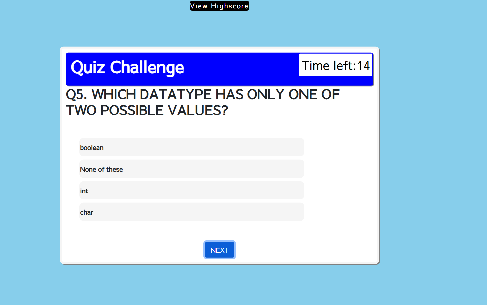

# code-quiz

# Introduction
This assignement design to develop a custom web based quiz application, where user can have different options for selecting answer.  
This web application includes three html pages index, quiz ,result. index page is starting page for game challenge, after ward all question-answer operation performed on quiz page, and final view of all highcore displays on result page. Also this application include one javascript (script.js)and once CSS (style.css), together both invoves to make the pages in action and colourful. User able to answer within given time, if not then user unable to choose any option. All conditions and rules are displays on intial (index.html) page to make user aware about challenge.

# Deployment
This application is deployed on github pages, 
to see running application simply go through this link : [code quiz](https://sthasub.github.io/code-quiz/)

# Screenshots
Application overview showing numbers of steps to achieve random secure password

1. Start or Welcome page

2. Question No.1 page

3. Question No.2 page

4. Question No.3 page

5. Question No.4 page

6. Question No.5 page

7. Click on highscore

8. Intials 

9. All Highscores with names 

# Futher Development

This application can be modified by adding more questions, and some more graphical features such as animated features. 
